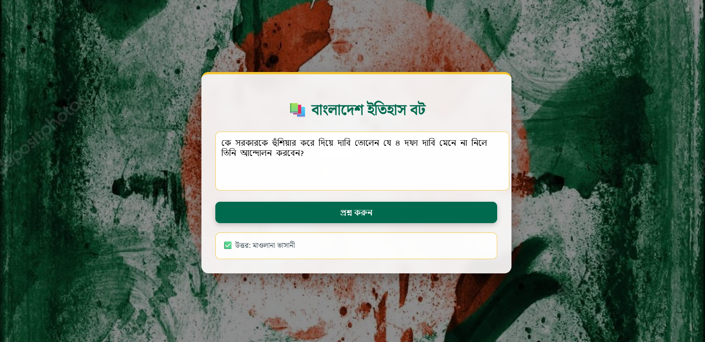

# Bangla-History-Chatbot

  

## 📜 Description

Bangla RAG QA is an AI-powered **Retrieval-Augmented Generation** (RAG) system built with **FastAPI** to **preserve and restore real Bangla history**.  
It can answer questions in Bangla using only trusted historical sources, ensuring that both the questions and answers remain fully in Bengali.

## 🎯 Main Aim

To create a **reliable digital archive of Bangla history** and make it searchable in natural Bangla language — no distortions, only facts from the original documents.

## 🛠 Tech Stack

- **Backend:** FastAPI  
- **OCR:** `bangla_pdf_ocr`  
- **Embeddings:** HuggingFace SBERT (Bangla)  
- **Vector Store:** ChromaDB  
- **LLM:** Groq / Gemini / OpenAI via LangChain  
- **Text Processing:** Unicode normalization & Bangla-specific cleanup

## 💡 Motivation

<section id="inspiration-data-source" style="font-family: 'Noto Serif Bengali', serif; line-height:1.6;">
  <h2>📜 Inspiration &amp; Data Source</h2>
  

    This project was inspired by the open-source initiative
    <strong><a href="https://github.com/mir-abir-hossain/real-history-of-Bangladesh" target="_blank" rel="noopener noreferrer">Real History of Bangladesh</a></strong>,
    which aims to preserve and present the authentic history of Bangladesh without distortion.
  

  

    The historical dataset was collected from the above project.
    Building upon this foundation, I developed the <strong>entire AI-powered RAG (Retrieval-Augmented Generation) pipeline</strong>, including:
  

  <ul>
    <li><strong>Data preprocessing &amp; Bangla text normalization</strong></li>
    <li><strong>Chunking &amp; semantic search indexing</strong></li>
    <li><strong>Context-aware question answering system</strong></li>
  </ul>

  

    While the source content is credited to <em>Real History of Bangladesh</em>,
    all preprocessing, pipeline design, and AI integration were implemented by me.
  

</section>

The goal is to make historical knowledge easily searchable in Bangla, ensuring both the questions and answers are in the native language, and that the answers are drawn only from verified historical documents.

This is an **open-source** effort and is completely free for improvement.  
Anyone interested in enhancing the dataset, improving accuracy, adding more models, or expanding features is welcome to contribute.  
Together, we can build a reliable, accessible, and truthful digital archive of Bangladesh’s history for future generations.

---

<section id="environment-setup" style="font-family: Arial, sans-serif; line-height:1.6;">
  <h2>🔑 Environment Setup</h2>
  

    This project requires API keys to access LLMs.
    If you are using <strong>Google Gemini</strong>, follow these steps:
  

  <ol>
    <li>
      <strong>Get a Gemini API Key</strong>
      <ul>
        <li>Sign in to <a href="https://aistudio.google.com/" target="_blank" rel="noopener noreferrer">Google AI Studio</a></li>
        <li>Go to <strong>API Keys</strong> and create a new one.</li>
      </ul>
    </li>
    <li>
      <strong>Create a <code>.env</code> file</strong> in your project root:
      <pre><code>GOOGLE_API_KEY=your_gemini_api_key_here</code></pre>
    </li>
  </ol>
</section>

<section id="project-setup-run" style="font-family: Arial, sans-serif; line-height:1.6; margin-top:20px;">
  <h2>⚙️ Project Setup &amp; Run</h2>
  <ol>
    <li><strong>Clone the repository</strong>:
      <pre><code>git clone https://github.com/your-username/your-repo.git
cd your-repo</code></pre>
    </li>
    <li><strong>Install dependencies</strong>:
      <pre><code>pip install -r requirements.txt</code></pre>
    </li>
    <li><strong>Run the application</strong>:
      <pre><code>uvicorn app:app --reload</code></pre>
    </li>
    <li>
      Open your browser and go to:
      <pre><code>http://127.0.0.1:8000</code></pre>
    </li>
  </ol>
</section>
